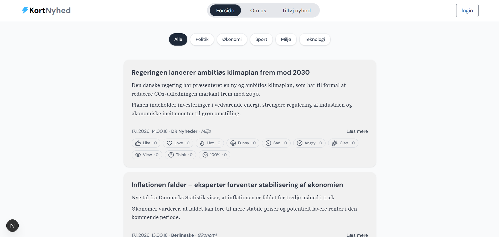

# Shortnews

Shortnews is an actively growing startup that rethinks how people consume news. The platform aggregates news from major Danish media sources and uses AI to analyze, summarize, and filter information — delivering only the most important news in a short, clear format.

The goal of Shortnews is simple: help people stay informed without information overload.

---

## 🚀 Idea & Vision

Modern news platforms overwhelm users with long articles, repeated topics, and unnecessary details. Shortnews solves this problem by combining news aggregation with AI-powered summarization.

Inspired by the concise style of **Ukrainian Telegram news channels**, Shortnews delivers short, meaningful updates that can be read in seconds.

Our vision is to become a fast, reliable daily news source for people who value time and clarity.

---

## 🧠 How Shortnews Works

1. News is collected from multiple Danish news outlets  
2. AI analyzes articles and extracts key information  
3. Long texts are transformed into short summaries  
4. Only the most relevant and important news is selected  
5. Users read brief, high-value news updates instead of full articles  

---

## ✨ Key Features

- Aggregation of Danish news sources  
- AI-based news summarization  
- Intelligent filtering of important topics  
- Short, Telegram-style news format  
- Clean, modern, and minimalistic UI  
- Backend API built with Python  

---

## 🖼️ Screenshots

> *(Add screenshots of the project interface here)*

